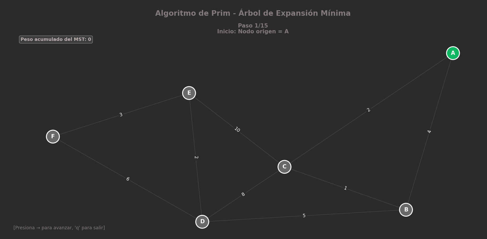
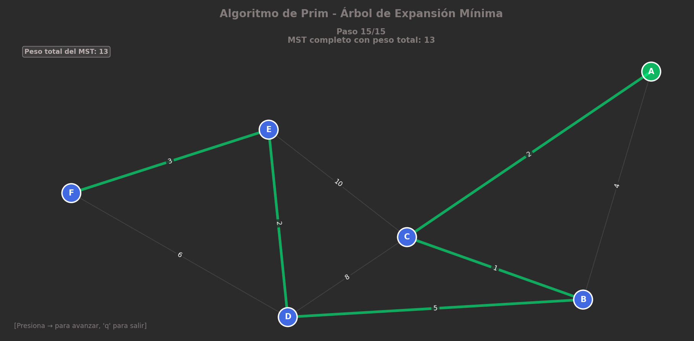

# Práctica 4: Algoritmo de Prim (IA)

Este repositorio contiene la implementación en Python del **Algoritmo de Prim**, desarrollado como parte de la materia de Inteligencia Artificial. El proyecto incluye el cálculo del Árbol de Expansión Mínima (MST) y una visualización gráfica del proceso sobre un grafo.

## ¿Qué es el Algoritmo de Prim?

El algoritmo de Prim (desarrollado por Robert C. Prim en 1957) es un algoritmo fundamental en la teoría de grafos. Se utiliza para encontrar el **Árbol de Expansión Mínima** (MST) en un grafo conexo y no dirigido con pesos. Esto significa que busca conectar *todos* los nodos del grafo minimizando la suma total de los pesos de las aristas, sin formar ciclos.

### ¿Cómo funciona?
1.  **Inicialización:** Selecciona un nodo de partida arbitrario y lo agrega a un conjunto de "visitados".
2.  **Exploración:** Identifica todas las aristas que conectan los nodos que ya están en el árbol (visitados) con los nodos que aún no lo están.
3.  **Selección:** De todas las aristas disponibles, elige aquella con el **peso mínimo** (menor costo) y agrega el nuevo nodo conectado al árbol.
4.  **Repetición:** Repite el proceso hasta que todos los nodos del grafo hayan sido visitados e incluidos en el árbol.


Es esencial en el diseño de redes (como tendido de cables eléctricos, tuberías o fibra óptica) donde el objetivo es interconectar puntos con el menor costo de material posible.

---

## Sobre el Código

Este script de Python implementa la lógica del algoritmo y la combina con una interfaz gráfica para facilitar su comprensión paso a paso.

**Características principales:**
* **Definición de Grafos:** Permite establecer nodos (vértices) y conexiones (aristas) con pesos específicos.
* **Cálculo del MST:** Determina qué aristas deben seleccionarse para conectar todo el grafo con el costo mínimo acumulado.
* **Visualización:** Muestra gráficamente el grafo, diferenciando entre nodos visitados, aristas en exploración y las aristas finales del MST.

---

## Visualización y Resultados

En esta sección se muestra el funcionamiento del algoritmo mediante la interfaz gráfica implementada.

### 1. Grafo Inicial
> *Aquí se muestra el grafo completo con sus nodos y pesos antes de comenzar la construcción del árbol.*



### 2. Árbol de Expansión Mínima (MST)
> *Visualización final donde se resaltan las aristas seleccionadas que forman el árbol de costo mínimo.*



---

## Cómo ejecutar

Para correr este proyecto en tu máquina local, asegúrate de tener Python instalado y las librerías necesarias (como `networkx` y `matplotlib`).

1.  Clona el repositorio:
    ```bash
    git clone [https://github.com/AlanDorantesVerdin/IA_P3_AlgoritmoPrim.git]
    ```
2.  Navega a la carpeta:
    ```bash
    cd IA_P3_AlgoritmoPrim
    ```
3.  Ejecuta el script principal:
    ```bash
    python Algoritmo_Prim.py
    ```

---

## Autor

* **Alan Dorantes Verdin** - [GitHub Profile](https://github.com/AlanDorantesVerdin)